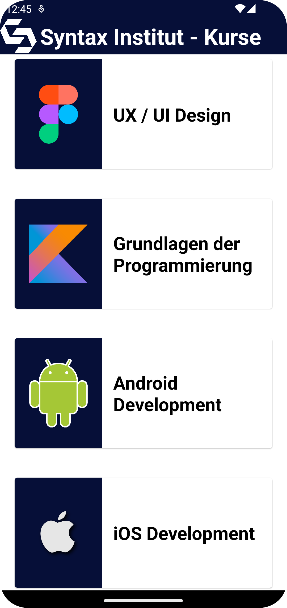

# Aufgaben

## Syntax App

Die heutige App ist euer Praxisfreitag und umfasst alle die bisherig gelernten Themen. 

Das Syntax-Institut möchte eine eigene App für die interne Nutzung haben! Hier kommst du als 
erfahrener Android-Entwickler ins Spiel. 

Die App soll in der MVVM-Architektur geschrieben sein, LiveData, ein SharedViewModel und eine 
RecyclerView verwenden. Darüber hinaus sollen Fragmente genutzt werden, um zwischen den Ansichten 
zu navigieren. 
Das sind große Anforderungen! Glücklicherweise hast du dich diese Woche mit etlichen Apps auseinandergesetzt, 
die diese Anforderungen beinhalten. Somit kannst du hier noch einmal reinschauen und schon 
viel Code übernehmen!  

Der unternehmensinterne Designer hat dir bereits Entwürfe der Layouts, samt Rahmenbedingungen der 
App, geschickt. Die Bedingungen lauten wie folgt:

Die App soll auf dem ersten Bildschirm eine Liste an Kursen enthalten, welche Syntax unterrichtet.  
Das sieht ungefähr so aus:

Wenn der User auf einen der Kurse klickt, soll man eine Detailansicht des Kurses bekommen. Hier soll 
einmal das Logo des Kurses als Hintergrund gesetzt sein, der Titel des Kurses soll angezeigt werden 
und auch eine kleine Beschreibung, was man in dem Kurs lernt.  
Das sieht ungefähr so aus:

Über den Knopf "Zurück zu den Kursen" soll man wieder zu der Übersicht an Kursen kommen. Zum Abschluss
soll beim Klicken auf den Knopf abgeschlossen der Hintergrund der Karte grün werden. Dies soll sich der
Kurs auch merken, wenn man ihn von der Liste aus wieder aufruft. Genauso soll der Hintergrund wieder 
weiß werden, wenn der Nutzer erneut auf den Button abgeschlossen klickt.  
Das sieht ungefähr so aus:

Viel Erfolg! Du schaffst das! Wenn du nicht weiter weißt, könnten dir die folgenden Tipps weiterhelfen.  

Hinweise

1. Erinnere dich an die MVVM-Architektur. Für diese App könnte sie wie folgt aussehen:

2. Starte damit, die dependencies einzufügen.  
3. Erstelle alle Packages, Klassen und Fragmente.  
4. Designe alle Layouts.  
5. Erstelle alle Navigationskomponenten.  
6. Programmiere alles im "Model" Abschnitt der MVVM-Architektur.  
7. Programmiere das SharedViewModel. Wahrscheinlich wirst du beim Programmieren der Fragmente 
hierher zurückkommen, um die Logik zu ergänzen.  
8. Programmiere den "View" Abschnitt der MVVM-Architektur. Starte am besten mit dem Adapter.  
9. Schaue nochmal in die LiveApps, nutze das Internet und stelle gezielte Fragen im Slack oder Zoom.

